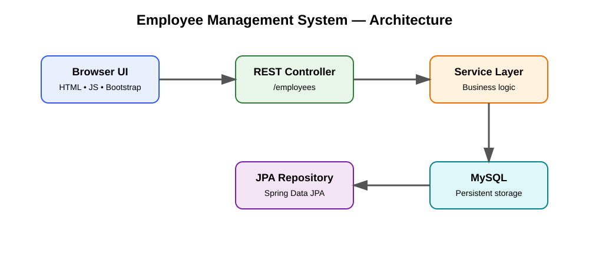

# 👨‍💼 Employee Management System

[](https://github.com/BhandMB/employee-management-system/actions/workflows/ci.yml)
[](https://www.oracle.com/java/)
[](https://spring.io/projects/spring-boot)
[](https://www.mysql.com/)

A recruiter-ready full-stack employee management application built with **Java 17, Spring Boot, Spring Data JPA, MySQL, REST APIs, Bootstrap, JavaScript, JUnit 5, Mockito, MockMvc, Maven, and GitHub Actions**.

## 🎯 Why this project matters

This project demonstrates an end-to-end software development workflow:

- RESTful employee APIs
- Layered Controller → Service → Repository architecture
- Spring Data JPA persistence
- MySQL integration
- Browser-based Bootstrap UI
- CRUD operations
- Automated controller and service tests
- CI build and test automation
- Environment-based database configuration

## 🏗️ Architecture



```text
Browser
   │
   ▼
Bootstrap / JavaScript UI
   │ HTTP / JSON
   ▼
Spring Boot REST Controller
   │
   ▼
Service Layer
   │
   ▼
Spring Data JPA Repository
   │
   ▼
MySQL
```

## ✨ Features

- View all employees
- Add employees
- Delete employees
- REST endpoints under `/employees`
- Browser-based employee dashboard
- JUnit 5 + Mockito + MockMvc tests
- Maven build
- GitHub Actions CI
- Environment-variable database credentials

## 🛠️ Tech Stack

| Area | Technology |
|---|---|
| Language | Java 17 |
| Backend | Spring Boot 4.1.0 |
| API | Spring Web / REST |
| Persistence | Spring Data JPA / Hibernate |
| Database | MySQL 8+ |
| Frontend | HTML, CSS, JavaScript, Bootstrap 5 |
| Testing | JUnit 5, Mockito, MockMvc |
| Build | Maven 3.9+ |
| CI | GitHub Actions |

## 📁 Project Structure

```text
src/main/java/com/example/employeemanagement/
├── controller/       # REST endpoints
├── service/          # Business logic
├── repository/       # Data access
└── model/            # Employee entity

src/main/resources/static/
├── index.html        # Employee dashboard
├── add.html          # Add employee page
└── script.js         # Frontend API integration

src/test/java/com/example/employeemanagement/
├── controller/       # MockMvc API tests
├── service/          # Mockito service tests
└── model/            # Entity tests
```

## 🚀 Run locally

### Prerequisites

- JDK 17+
- Maven 3.9+
- MySQL 8+

Create the database:

```sql
CREATE DATABASE emsdb;
```

Set environment variables before starting the application:

```text
DB_URL=jdbc:mysql://localhost:3306/emsdb
DB_USERNAME=root
DB_PASSWORD=your_password
```

Then run:

```bash
mvn clean test
mvn spring-boot:run
```

Open the web application:

```text
http://localhost:8080/
```

## 🔌 API

| Method | Endpoint | Purpose |
|---|---|---|
| GET | `/employees` | List employees |
| POST | `/employees` | Create employee |
| DELETE | `/employees/{id}` | Delete employee |

### Create employee

```http
POST /employees
Content-Type: application/json
```

```json
{
  "name": "Mayur Bhand",
  "department": "Engineering",
  "email": "mayur@example.com",
  "salary": 65000
}
```

### Example response

```json
{
  "id": 1,
  "name": "Mayur Bhand",
  "department": "Engineering",
  "email": "mayur@example.com",
  "salary": 65000
}
```

More copy-paste-ready examples are available in [`docs/api-examples.md`](docs/api-examples.md).

## 🧪 Testing

The repository includes:

- **MockMvc controller tests** for HTTP/API behavior
- **Mockito service tests** for business logic
- **Model tests** for the Employee domain object

Run everything locally:

```bash
mvn test
```

## ⚙️ Continuous Integration

Every push to `main` runs GitHub Actions with JDK 17 and Maven. The CI job builds the application and executes the test suite.

## 🔐 Configuration & Security

Database credentials are supplied through environment variables. No real password is committed to the repository.

For local development, start from:

`src/main/resources/application-example.properties`

Never commit `.env` files, passwords, API keys, or production credentials.

## 📸 Screenshots

The application includes a real Bootstrap browser UI. To keep the repository honest, screenshots should be captured from the **running application** after MySQL is configured rather than using generated mockups.

Recommended screenshots for the repository:

1. Employee dashboard
2. Add employee form
3. Successful employee creation
4. API response in Postman/Swagger

## 📚 Documentation

- [API Examples](docs/api-examples.md)
- [Architecture Diagram](docs/architecture.svg)

## 🔭 Future improvements

- Employee update endpoint
- Pagination and search
- DTOs and Bean Validation
- Global exception handling
- Authentication and role-based access
- Docker Compose for MySQL

## 👨‍💻 Author

**Mayur Bhand**

- GitHub: [BhandMB](https://github.com/BhandMB)
- LinkedIn: [mayurbhand](https://www.linkedin.com/in/mayurbhand/)
xx
